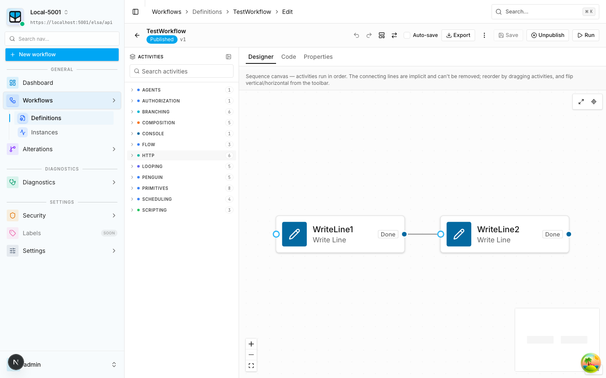
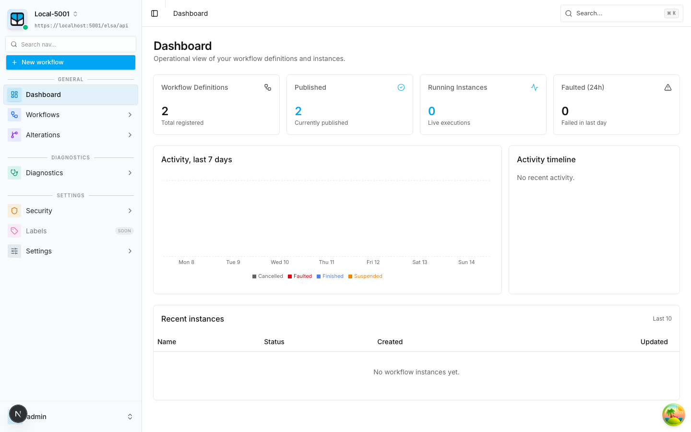
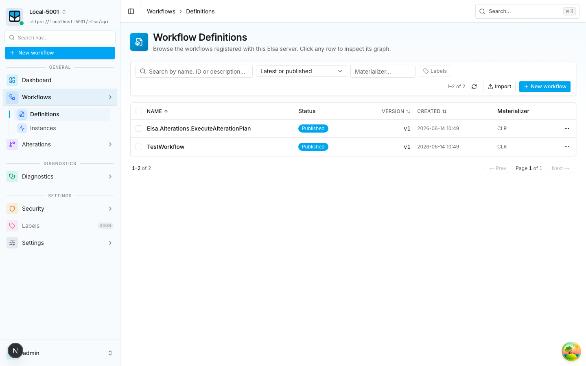
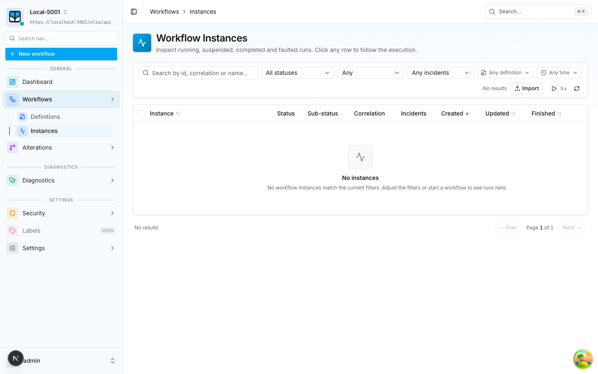
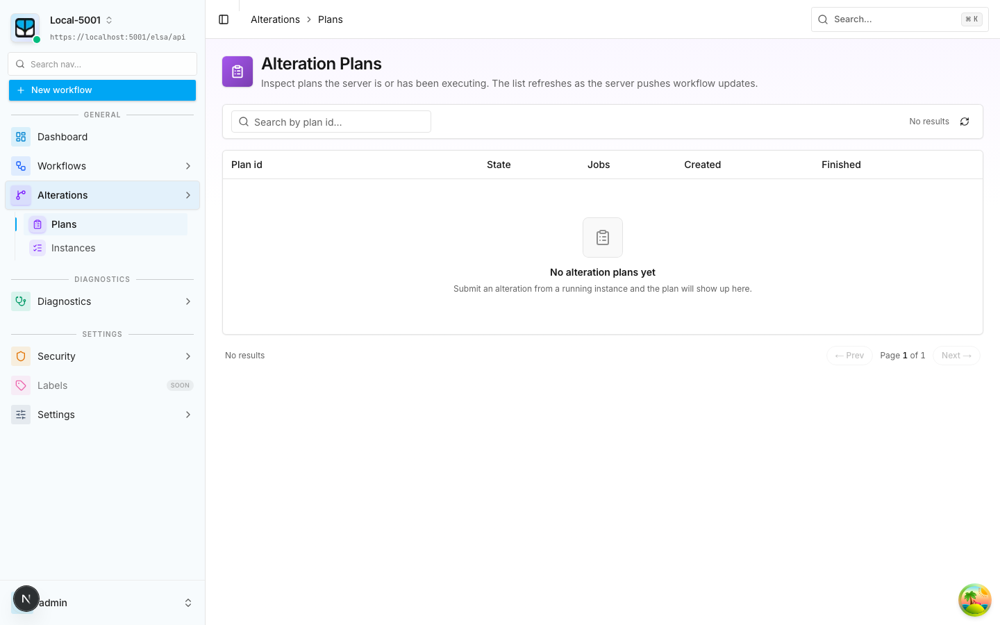
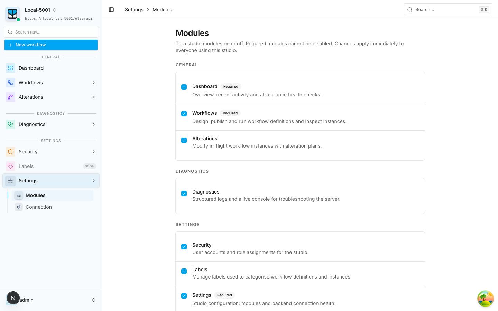
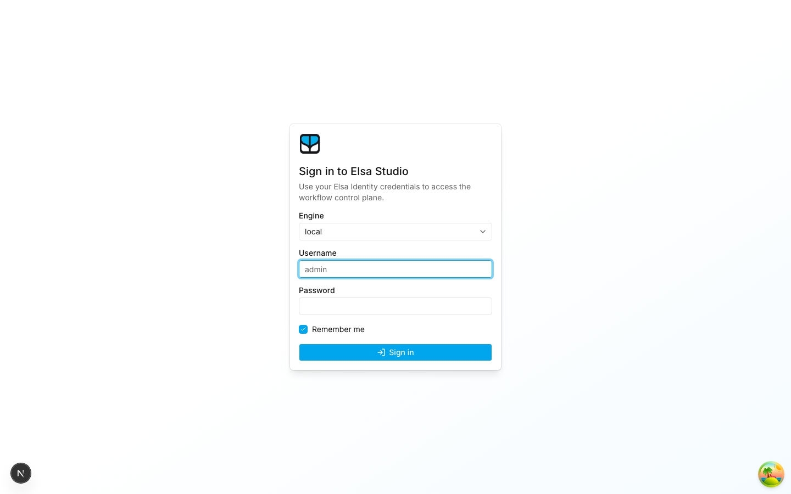
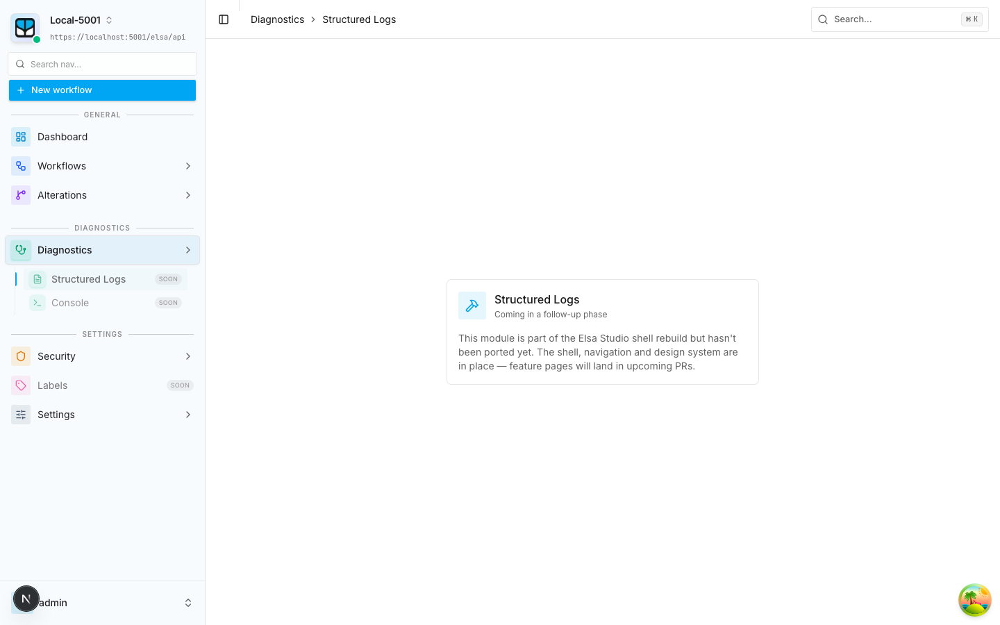
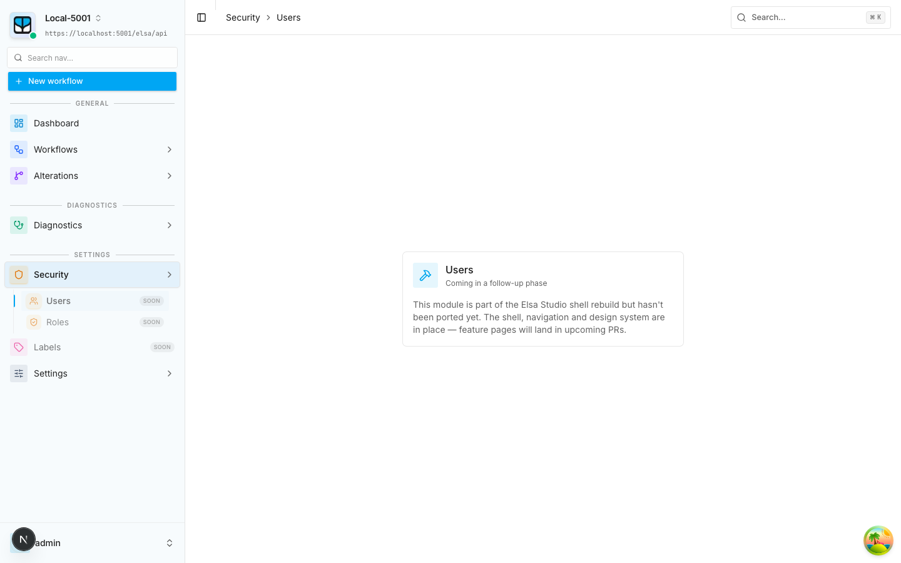
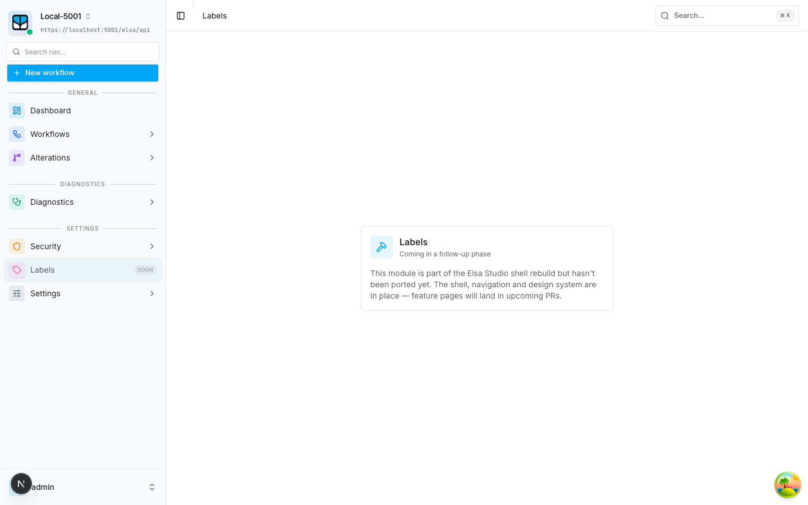

# Elsa Studio Next

A modern, fast control plane for [Elsa Workflows](https://elsaworkflows.io/) — a
ground-up rebuild of Elsa Studio on **Next.js** (App Router), **TypeScript**,
**Tailwind v4** and **shadcn/ui**. Design workflows on a drag-and-drop canvas,
publish and run them, and inspect every execution — all against your existing
Elsa Workflow Server over its REST API.

The studio is modular: each feature (Workflows, Alterations, Diagnostics, …)
plugs into a shared shell and can be toggled on or off per deployment.

## A quick tour

### Workflow designer

Drag activities onto the canvas and wire them together. New activities flow
left-to-right by default; reorder by dragging, flip orientation, and switch
between the visual **Designer**, raw **Code** and **Properties** views.



### Dashboard

At-a-glance health: definition counts, live instances, faults in the last 24h,
a 7-day activity chart and the most recent runs.



### Workflow definitions & instances

Browse, search and filter every workflow registered with the server, then drill
into individual runs to follow their execution.

| Definitions | Instances |
|---|---|
|  |  |

### Alterations

Inspect alteration plans the server is executing and modify in-flight workflow
instances.



### Settings

Turn studio modules on or off and check backend connection health. Required
modules (Dashboard, Workflows, Settings) can't be disabled.



### Sign in

ElsaIdentity username/password against your chosen engine.



> **Coming in a follow-up phase.** The shell, navigation and design system are in
> place for these modules; the feature pages land in upcoming PRs.
>
> | Diagnostics | Security | Labels |
> |---|---|---|
> |  |  |  |

## Quick start

```bash
pnpm install
cp .env.example .env.local            # point ELSA_API_URL at your local Elsa server
pnpm gen:api                          # generates lib/api/generated/elsa.d.ts from /swagger/v1/swagger.json
pnpm dev                              # http://localhost:3000
```

You'll need a local Elsa Workflow Server (default `https://localhost:5001/elsa/api`)
with CORS allowing `http://localhost:3000` and an ElsaIdentity admin user.

Self-signed dev cert? Set `NODE_EXTRA_CA_CERTS=/path/to/cert.crt` in `.env.local`.

## Scripts

| Script | What |
|---|---|
| `pnpm dev` | Start the dev server. |
| `pnpm build` | Production build. |
| `pnpm start` | Run the production build. |
| `pnpm lint` | ESLint (next config). |
| `pnpm typecheck` | `tsc --noEmit`. |
| `pnpm format` | Prettier write. |
| `pnpm gen:api` | Regenerate Elsa TS types from swagger. |

## Layout

```
app/(app)/...        # protected routes (shell + dashboard + module placeholders)
app/(auth)/login     # sign-in page
app/api/auth/...     # 4 route handlers: login, refresh, logout, me
components/ui        # shadcn primitives
components/app       # shell, providers, app-level shared components
features/*           # one folder per studio module (dashboard, workflows, …)
lib/api              # ky client + generated types + TanStack Query hooks
lib/auth             # cookie session helpers
lib/modules/         # module manifest, registry, route guard + enable/disable
middleware.ts        # cookie-based auth + module gate
```

## Working in this repo

Studio features are pluggable modules — each owns its sidebar entry, route
segments and i18n strings, and toggles on/off from **Settings → Modules**.
Implementing or extending one is documented in depth, with copy-pasteable
recipes:

- **[`docs/`](docs/)** — authoritative docs ([architecture tour](docs/architecture-tour.md),
  the [module guide](docs/modules.md), the [extension-point catalog](docs/extension-points.md),
  a [glossary](docs/glossary.md)).
- **`.claude/skills/designer-*`** — fast entry points usable from Claude Code:
  `/designer-create-module`, `/designer-extend-module`, `/designer-migrate-feature`,
  `/designer-architecture-tour`, `/designer-extension-points`, `/designer-verify`,
  `/designer-glossary-lookup`. See [`docs/skills/catalog.md`](docs/skills/catalog.md).

Start with **[docs/modules.md](docs/modules.md)** to add or extend a module.

## Auth model (phase 1)

ElsaIdentity username/password only. JWT access + refresh tokens stored as
**httpOnly cookies** via Next route handlers acting as a thin proxy. OIDC is
deferred to a follow-up phase.
